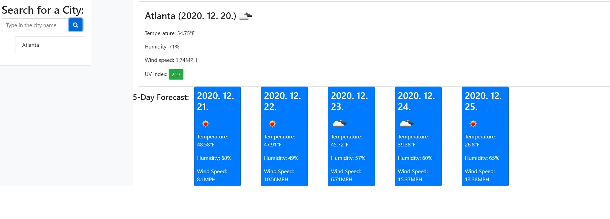

# Today's Weather

## Description:
* ##### This is the Today's Weather created with AJAX and API with <https://openweather.org> using HTML/CSS with Jquery, Bootstrap, and Font-Awesome.
 ---
 ## Table of Contents:
* [Features](#features)
* [Contribution](#contribution)
* [Credit](#credit)
* [License](#license)
 ---
 ## Features
 
  1. ##### Type the name of cities you inside the search bar, then click "search" button.
    

---
 

 1. ##### Upon typing your choice of cities, the result will show Today's weather with temperature, humidity, wind speed, and UV index.
 2. ##### Furthermore, at the bottom, it will show "5-Day Forecast" for the chosen city.

---
 ## Contribution:
 ##### Thank You:
- All of my classmates from the study group, TAs, tutor and the instructor from the Georgia Tech Boot Camp.
##### Be A Contributor!
- If you would like to contribute to the open source, here is the the link: <https://ahnlok.github.io/serverside-api-hw06/>
---
## Credit:
Sungpil An <ansungpil1@gmail.com>
##### URL:
- GitPage: <https://ahnlok.github.io/serverside-api-hw06/>
- GitHubRepository: <https://github.com/ahnlok/serverside-api-hw06>

##### Website Used:
- Bootstrap: <https://getbootstrap.com/>
- OpenWeather: <https://openweathermap.org/>
- Font Awesome: <https://fontawesome.com/>
---
## License: 
© Sungpil An, Georgia Tech Coding Bootcamp

Licensed under the MIT License:
Copyright (c) [2020] [Sungpil An]

Permission is hereby granted, free of charge, to any person obtaining a copy of this software and associated documentation files (the "Software"), to deal in the Software without restriction, including without limitation the rights to use, copy, modify, merge, publish, distribute, sublicense, and/or sell copies of the Software, and to permit persons to whom the Software is furnished to do so, subject to the following conditions:

The above copyright notice and this permission notice shall be included in all copies or substantial portions of the Software.

THE SOFTWARE IS PROVIDED "AS IS", WITHOUT WARRANTY OF ANY KIND, EXPRESS OR IMPLIED, INCLUDING BUT NOT LIMITED TO THE WARRANTIES OF MERCHANTABILITY, FITNESS FOR A PARTICULAR PURPOSE AND NONINFRINGEMENT. IN NO EVENT SHALL THE AUTHORS OR COPYRIGHT HOLDERS BE LIABLE FOR ANY CLAIM, DAMAGES OR OTHER LIABILITY, WHETHER IN AN ACTION OF CONTRACT, TORT OR OTHERWISE, ARISING FROM, OUT OF OR IN CONNECTION WITH THE SOFTWARE OR THE USE OR OTHER DEALINGS IN THE SOFTWARE.